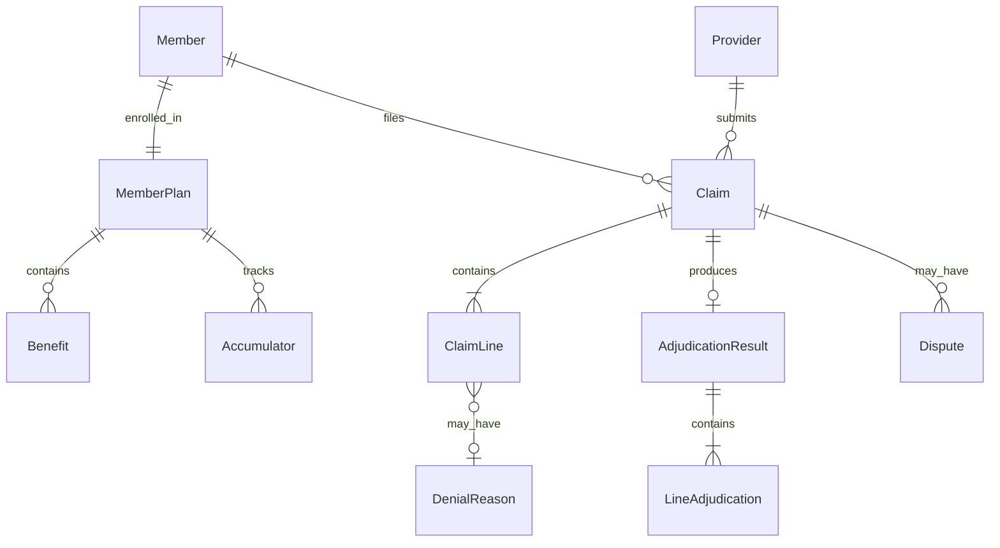

# Health Insurance Claims Processing — Research Summary

Research notes for a simplified claims processing system. For each concept: brief explanation, why it matters to the system, and how it could be represented in software.

---

## 1. Claim Lifecycle

### What it is

The end-to-end path of a claim from creation to final disposition: submission → intake/validation → eligibility & coverage check → adjudication → payment or denial → remittance → possible appeal/resubmission.

### Why it matters

Every system feature hangs off this workflow. State transitions drive what actions are allowed, what data is required, and what downstream systems (payments, member communications, reporting) get triggered.

### Software representation

- `Claim` entity with `status` enum: `DRAFT`, `SUBMITTED`, `IN_REVIEW`, `ADJUDICATED`, `PAID`, `DENIED`, `APPEALED`, `CLOSED`
- State machine enforcing valid transitions
- `ClaimEvent` / audit log for each transition (who, when, why)
- Timestamps: `submittedAt`, `adjudicatedAt`, `paidAt`

---

## 2. Adjudication

### What it is

The decision engine that evaluates a claim against the member's plan, provider contract, and clinical/policy rules to determine allowed amount, member responsibility, and payer responsibility.

### Why it matters

This is the core business logic. Incorrect adjudication means wrong payments, compliance risk, and member/provider disputes.

### Software representation

- `AdjudicationResult` with: `allowedAmount`, `paidAmount`, `memberResponsibility`, `denialReasons[]`, `lineItems[]`
- `AdjudicationEngine` (service) that takes `Claim` + `MemberPlan` + `ProviderContract` → `AdjudicationResult`
- Rule evaluation as a pipeline: eligibility → coverage → pricing → cost-sharing → limits
- Idempotent runs with versioned inputs (plan snapshot at time of service)

---

## 3. Coverage Rules

### What it is

Plan-defined conditions for whether a service is covered: benefit category, in-network vs out-of-network, prior authorization, medical necessity, exclusions, age/gender limits, etc.

### Why it matters

Coverage is evaluated before pricing. A service can be medically valid but still not covered under the plan.

### Software representation

- `Benefit` / `CoverageRule` with predicates: `serviceCode`, `diagnosisCode`, `placeOfService`, `networkTier`, `requiresPriorAuth`
- Rule engine pattern: `Rule` → `matches(claimLine, memberPlan)` → `CoverageDecision` (`COVERED`, `NOT_COVERED`, `CONDITIONAL`)
- `PriorAuthorization` linked to claim lines when required

---

## 4. Deductibles

### What it is

The amount a member pays out-of-pocket before the plan starts paying (for covered services in that deductible tier). Often split: individual vs family, in-network vs out-of-network.

### Why it matters

Deductible tracking is cumulative across claims in a benefit period. The system must know how much has been met to compute member vs payer share correctly.

### Software representation

- `DeductibleAccumulator` per member/plan/year: `amountMet`, `amountLimit`, `tier` (individual/family, in/out)
- On adjudication: check remaining deductible → apply to `memberResponsibility` first → update accumulator
- `BenefitPeriod` (usually calendar or plan year) scopes accumulation

---

## 5. Coverage Percentages (Coinsurance / Copays)

### What it is

After deductible is met, cost-sharing splits between member and plan:

- **Copay**: fixed amount per visit/service
- **Coinsurance**: percentage split (e.g., plan pays 80%, member pays 20%)

### Why it matters

Same allowed amount can produce very different member bills depending on copay vs coinsurance and network tier.

### Software representation

- `CostSharingRule` on plan/benefit: `type` (`COPAY` | `COINSURANCE`), `memberRate` (e.g., 0.20), `payerRate` (0.80), `copayAmount`
- Applied after `allowedAmount` and deductible logic
- `memberResponsibility = copay OR (allowedAmount - deductibleApplied) * memberRate`

---

## 6. Annual Limits

### What it is

Caps on benefits per period: out-of-pocket maximum (OOP max), annual/lifetime benefit maximums, visit limits (e.g., 20 PT visits/year). OOP max stops member cost-sharing once reached; benefit max can deny further coverage.

### Why it matters

Accumulators must be tracked and checked on every claim. Hitting OOP max changes cost-sharing to 100% plan-paid for covered services.

### Software representation

- `Accumulator` types: `DEDUCTIBLE`, `OOP_MAX`, `BENEFIT_USAGE` (visit count or dollar cap)
- `AccumulatorLedger` with running totals per benefit period
- Adjudication step: `if oopMet >= oopMax → memberResponsibility = 0`
- `BenefitLimit` with `maxUnits`, `usedUnits`, `unitType` (`VISITS`, `DOLLARS`)

---

## 7. Partial Approvals

### What it is

A claim (or claim line) is approved for less than billed—e.g., some lines paid, some denied; or allowed amount reduced due to bundling, downcoding, or quantity limits.

### Why it matters

Real claims rarely resolve to a single binary outcome. Payment, EOB (explanation of benefits), and appeals all need line-level granularity.

### Software representation

- Adjudicate at **line item** level, not just claim header
- `ClaimLine` with its own `status`: `APPROVED`, `PARTIALLY_APPROVED`, `DENIED`
- `ClaimLine.adjudication`: `billedAmount`, `allowedAmount`, `paidAmount`, `denialCodes[]`
- Claim-level status = rollup of line statuses

---

## 8. Denials

### What it is

A formal rejection of payment, with standardized reason codes (e.g., not covered, no prior auth, duplicate, timely filing, medical necessity). Can be at claim or line level.

### Why it matters

Denials drive rework (corrected claims), member/provider communication, and appeal workflows. Reason codes are required for compliance and analytics.

### Software representation

- `Denial` / `DenialReason` with industry codes (CARC/RARC-style): `code`, `description`, `remediationHint`
- Link denials to `ClaimLine` or `Claim`
- `DenialCategory`: `COVERAGE`, `ELIGIBILITY`, `ADMINISTRATIVE`, `CLINICAL`
- Trigger workflows: resubmit, appeal, write-off

---

## 9. Disputes

### What it is

When a member or provider challenges an adjudication outcome—internal appeal, external review, or grievance. Has its own lifecycle and deadlines.

### Why it matters

Regulatory requirements (e.g., appeal timelines) and customer satisfaction. The system must preserve original adjudication, track dispute state, and support re-adjudication.

### Software representation

- `Dispute` / `Appeal` linked to `Claim` or `ClaimLine`
- `status`: `FILED`, `UNDER_REVIEW`, `UPHELD`, `OVERTURNED`, `CLOSED`
- `originalAdjudicationId` + `revisedAdjudicationId` for audit trail
- Deadlines: `filedAt`, `dueBy`, `resolvedAt`

---

## Minimum Domain Model

The smallest model that can run a claim through adjudication and produce a defensible outcome.

### Entity Relationship Overview



### Core Entities

| Entity | Key Fields | Purpose |
|--------|-----------|---------|
| **Member** | `id`, `name`, `dateOfBirth` | Who received care |
| **MemberPlan** | `memberId`, `planId`, `effectiveDate`, `terminationDate`, `networkTier` | Active coverage at time of service |
| **Benefit** | `planId`, `serviceCategory`, `costSharingRule`, `coverageRules`, `limits` | What's covered and how cost is shared |
| **Provider** | `id`, `name`, `networkStatus` | Who rendered care |
| **Claim** | `id`, `memberId`, `providerId`, `dateOfService`, `status`, `lines[]` | The submission unit |
| **ClaimLine** | `id`, `claimId`, `procedureCode`, `diagnosisCode`, `billedAmount`, `units` | Atomic unit of adjudication |
| **AdjudicationResult** | `claimId`, `adjudicatedAt`, `lineResults[]`, `totalPaid`, `totalMemberResp` | Decision output |

### Supporting Concepts

| Concept | Representation |
|---------|----------------|
| **Accumulators** | `Accumulator(memberId, planId, period, type, amountMet, amountLimit)` — updated on each adjudication |
| **Denial** | Embedded in `LineAdjudication`: `status`, `denialCode`, `denialMessage` |
| **Dispute** | Optional 8th entity if scope includes appeals: `claimId`, `reason`, `status`, `originalResultId` |

### Minimal Adjudication Pipeline

```
1. Validate claim (required fields, DOS within eligibility)
2. For each ClaimLine:
   a. Check coverage rules → covered?
   b. Compute allowed amount (simplified: % of billed or fee schedule lookup)
   c. Apply deductible (from accumulator)
   d. Apply copay/coinsurance
   e. Check OOP max / benefit limits
   f. Produce LineAdjudication (approved / partial / denied)
3. Roll up to Claim status + AdjudicationResult
4. Update accumulators
```

### Deliberate Simplifications

For a take-home scope, skip or stub:

- Fee schedules / contract pricing (use flat allowed % or lookup table)
- Prior authorization workflow (boolean flag on benefit)
- Coordination of benefits (secondary insurance)
- Capitation, pharmacy/NCPDP specifics
- Full CARC/RARC code libraries (use a small enum)
- Payment/remittance (EOB generation is enough)

### Suggested Enums

```typescript
ClaimStatus: SUBMITTED | IN_REVIEW | ADJUDICATED | PAID | DENIED | APPEALED
LineStatus: APPROVED | PARTIALLY_APPROVED | DENIED
AccumulatorType: DEDUCTIBLE | OOP_MAX | BENEFIT_VISITS | BENEFIT_DOLLARS
CostSharingType: COPAY | COINSURANCE
```

---

## Research Narrative

How the concepts connect for the assignment write-up:

1. **Lifecycle** defines system boundaries and state management.
2. **Adjudication** is the core service; everything else feeds into it.
3. **Coverage rules** gate whether pricing logic runs.
4. **Deductibles, percentages, limits** are accumulator-driven cost-sharing steps in the pipeline.
5. **Partial approvals & denials** require line-level adjudication, not claim-level booleans.
6. **Disputes** are a second lifecycle layered on top, referencing frozen adjudication snapshots.

**Minimum viable model:** Member + Plan + Benefit + Claim + ClaimLine + AdjudicationResult + Accumulator, with Dispute as optional scope expansion.
