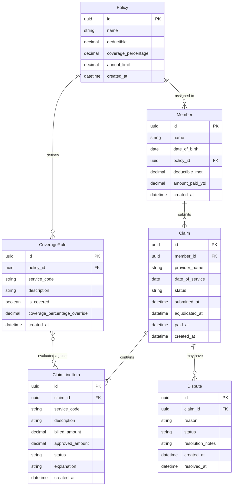
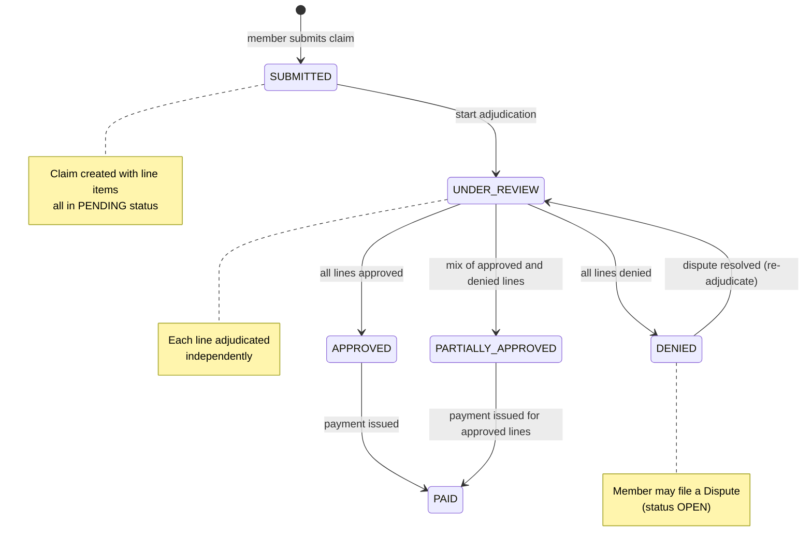
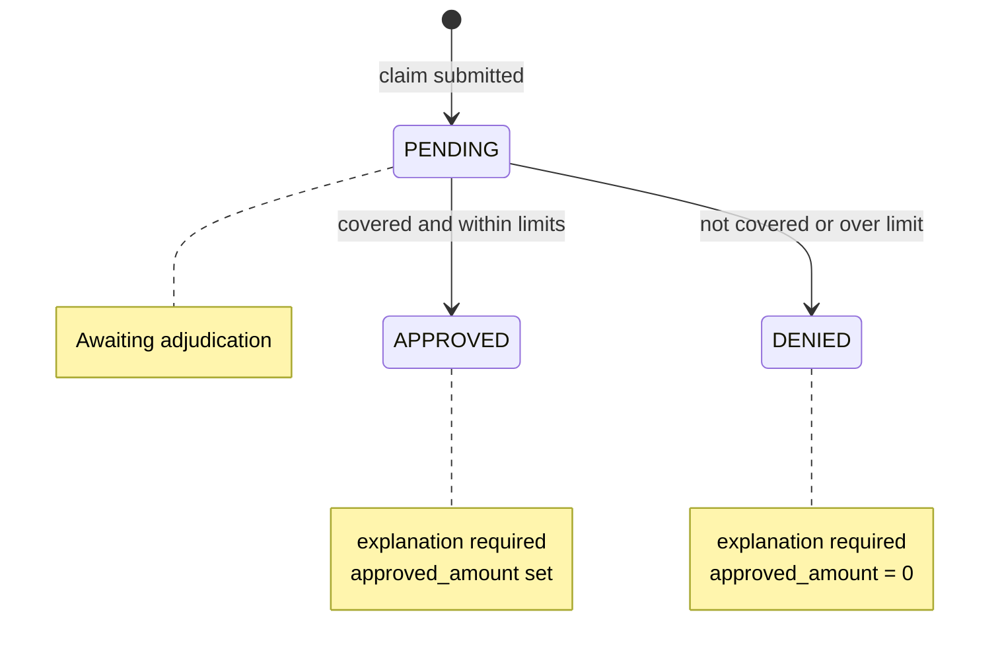
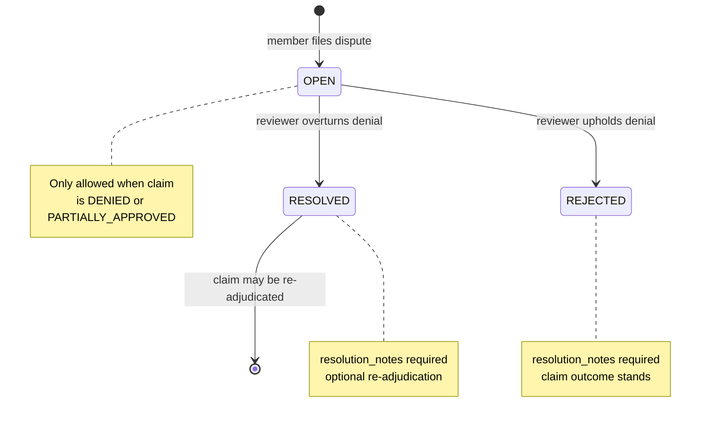

# Domain Model — Simplified Claims Processing

A minimal domain model for a 24–48 hour take-home assignment. Six entities, three state machines, and line-level adjudication. Designed for clarity, explainability, and straightforward implementation in **FastAPI + SQLAlchemy**.

---

## Design Principles

1. **Six entities only** — no separate adjudication result, accumulator ledger, or provider tables.
2. **Line items are the unit of decision** — claim status is derived from its lines.
3. **Policy holds cost-sharing config** — deductible, coverage %, annual limit live in one place.
4. **Every decision is explainable** — `explanation` is required whenever a line is approved or denied.
5. **Money as `Decimal`** — never float for currency fields.

---

## Entity Relationship Diagram



---

## Entities

### 1. Member

**Purpose**  
Represents the insured person who received care and submits claims.

**Fields**

| Field | Type | Notes |
|-------|------|-------|
| `id` | UUID | Primary key |
| `name` | string | Display name |
| `date_of_birth` | date | Optional eligibility checks |
| `policy_id` | UUID (FK) | Active policy |
| `deductible_met` | decimal | Running total toward policy deductible (resets annually in a full system; static for take-home) |
| `amount_paid_ytd` | decimal | Running total paid by insurer this period — used for annual limit |
| `created_at` | datetime | Audit |

**Relationships**

- **has one** active `Policy`
- **has many** `Claim`s

**Why it exists**  
Claims belong to a person. Cost-sharing math (deductible, annual limit) is tracked per member, not per policy template.

---

### 2. Policy

**Purpose**  
Defines the insurance plan's financial terms — the rules that govern how much the insurer pays.

**Fields**

| Field | Type | Notes |
|-------|------|-------|
| `id` | UUID | Primary key |
| `name` | string | e.g. "Gold PPO 2026" |
| `deductible` | decimal | Amount member pays before insurer shares cost |
| `coverage_percentage` | decimal | Insurer's share after deductible (0.0–1.0, e.g. `0.80`) |
| `annual_limit` | decimal | Max insurer payout per member per period |
| `created_at` | datetime | Audit |

**Relationships**

- **has many** `Member`s — a policy may be assigned to multiple members
- **has many** `CoverageRule`s

**Why it exists**  
Separates *plan configuration* from *member state*. One policy template is shared across many members; each member's deductible_met and amount_paid_ytd stay on the member.

---

### 3. CoverageRule

**Purpose**  
Determines whether a specific service is covered under a policy, and optionally overrides the policy's default coverage percentage for that service.

**Fields**

| Field | Type | Notes |
|-------|------|-------|
| `id` | UUID | Primary key |
| `policy_id` | UUID (FK) | Parent policy |
| `service_code` | string | e.g. `"99213"` (office visit), `"80053"` (lab panel) |
| `description` | string | Human-readable service name |
| `is_covered` | boolean | `true` = eligible for payment if other rules pass |
| `coverage_percentage_override` | decimal (nullable) | Service-specific insurer share after deductible; falls back to `policy.coverage_percentage` when null |
| `created_at` | datetime | Audit |

**Relationships**

- **belongs to** one `Policy`
- **evaluated against** `ClaimLineItem`s at adjudication time (match on `service_code`)

**Why it exists**  
Not every service on a claim is covered, and not every covered service shares cost the same way. Coverage is the first gate in adjudication — if `is_covered` is false, the line is denied before any cost-sharing math runs. When covered, `coverage_percentage_override` lets specific services (e.g. vision at 90%, dental at 70%) differ from the policy default (e.g. 80%) without duplicating entire policies.

---

### 4. Claim

**Purpose**  
A single healthcare reimbursement request submitted by a member for one episode of care.

**Fields**

| Field | Type | Notes |
|-------|------|-------|
| `id` | UUID | Primary key |
| `member_id` | UUID (FK) | Submitting member |
| `provider_name` | string | Who rendered care (string, not a separate entity) |
| `date_of_service` | date | When care was received |
| `status` | enum | See [Claim States](#claim-states) |
| `submitted_at` | datetime | Set on submission |
| `adjudicated_at` | datetime | Set when all lines are decided |
| `paid_at` | datetime | Set when claim moves to PAID |
| `created_at` | datetime | Audit |

**Relationships**

- **belongs to** one `Member`
- **has many** `ClaimLineItem`s (≥ 1 required)
- **has many** `Dispute`s (optional; only meaningful when denied)

**Why it exists**  
The aggregate unit members interact with. Header holds shared context (provider, date); financial decisions happen at the line level.

---

### 5. ClaimLineItem

**Purpose**  
A single billable service within a claim. The atomic unit of adjudication.

**Fields**

| Field | Type | Notes |
|-------|------|-------|
| `id` | UUID | Primary key |
| `claim_id` | UUID (FK) | Parent claim |
| `service_code` | string | Matched against `CoverageRule` |
| `description` | string | e.g. "Office visit — established patient" |
| `billed_amount` | decimal | Amount provider charged |
| `approved_amount` | decimal | Amount insurer agrees to pay (null until adjudicated) |
| `status` | enum | See [ClaimLineItem States](#claimlineitem-states) |
| `explanation` | string | **Required** when status is APPROVED or DENIED |
| `created_at` | datetime | Audit |

**Relationships**

- **belongs to** one `Claim`
- **evaluated against** `CoverageRule` (via `service_code` + member's policy)

**Why it exists**  
Real claims contain multiple services with different coverage outcomes. Line-level adjudication enables partial approvals and per-line explanations.

---

### 6. Dispute

**Purpose**  
A member's challenge to a denied claim outcome.

**Fields**

| Field | Type | Notes |
|-------|------|-------|
| `id` | UUID | Primary key |
| `claim_id` | UUID (FK) | The denied claim being disputed |
| `reason` | string | Member's explanation for the dispute |
| `status` | enum | See [Dispute States](#dispute-states) |
| `resolution_notes` | string | Reviewer's explanation (required on resolve/reject) |
| `created_at` | datetime | When dispute was filed |
| `resolved_at` | datetime | When dispute was closed |

**Relationships**

- **belongs to** one `Claim` (claim must be `DENIED` or `PARTIALLY_APPROVED`)

**Why it exists**  
Denials are not always final. Disputes model the appeal path without building a full re-adjudication engine — resolution can be manual for the take-home.

---

## State Machines

### Claim States



| State | Meaning |
|-------|---------|
| `SUBMITTED` | Claim received, not yet reviewed |
| `UNDER_REVIEW` | Adjudication in progress |
| `APPROVED` | Every line item approved |
| `PARTIALLY_APPROVED` | At least one line approved and at least one denied |
| `DENIED` | Every line item denied |
| `PAID` | Payment issued for approved amount(s) |

**Rollup rules** (computed after all lines are adjudicated):

```
all lines APPROVED          → Claim APPROVED
all lines DENIED            → Claim DENIED
mix of APPROVED + DENIED    → Claim PARTIALLY_APPROVED
```

---

### ClaimLineItem States



| State | Meaning |
|-------|---------|
| `PENDING` | Not yet adjudicated |
| `APPROVED` | Insurer will pay (up to `approved_amount`) |
| `DENIED` | Insurer will not pay |

---

### Dispute States



| State | Meaning |
|-------|---------|
| `OPEN` | Dispute filed, awaiting review |
| `RESOLVED` | Reviewer sided with member |
| `REJECTED` | Original denial upheld |

---

## Adjudication Logic (Reference)

Simplified pipeline applied per `ClaimLineItem`:

```
1. Find CoverageRule for (member.policy, line.service_code)
   → no rule or is_covered=false  →  DENY  ("Service not covered under your policy")
   → is_covered=true                →  continue

2. Compute allowed amount
   → allowed = min(billed_amount, remaining annual limit)

3. Apply deductible
   → if member.deductible_met < policy.deductible:
       member_share = min(allowed, policy.deductible - member.deductible_met)
       insurer_share = allowed - member_share
       update member.deductible_met
     else:
       coverage_pct = rule.coverage_percentage_override ?? policy.coverage_percentage
       insurer_share = allowed * coverage_pct

4. Check annual limit
   → if member.amount_paid_ytd + insurer_share > policy.annual_limit:
       insurer_share = policy.annual_limit - member.amount_paid_ytd
       → if insurer_share <= 0  →  DENY  ("Annual benefit limit reached")

5. APPROVE with approved_amount = insurer_share
   → explanation = human-readable summary of steps 2–4
   → update member.amount_paid_ytd
```

After all lines are processed, roll up claim status and set `adjudicated_at`.

---

## Design Decisions

### Why only six entities?

A take-home should demonstrate judgment about what to **exclude**. Separate entities for Provider, AdjudicationResult, Accumulator, and FeeSchedule add realism but distract from the core loop: *submit → adjudicate lines → explain outcome → optionally dispute*.

### Why accumulators on Member, not Policy?

`Policy` is a reusable template (`deductible = $500`). `Member.deductible_met` is instance state (`$320 used so far`). Collapsing both onto Policy would conflate configuration with runtime data.

### Why `coverage_percentage_override` on CoverageRule?

Some benefits pay at a different rate than the policy default (e.g. 90% vision vs 80% general). A nullable override on the matched rule avoids cloning policies or adding benefit-tier entities. When null, adjudication uses `policy.coverage_percentage`.

### Why provider as a string on Claim?

A `Provider` entity adds NPI lookup, network tiers, and contract pricing — enterprise scope. A string field keeps the model honest about what this system does and does not model.

### Why explanation on ClaimLineItem, not a separate table?

The requirement is "every approval or denial must have a human-readable explanation." A single `explanation` text field on the line is the simplest correct representation. No need for a `Decision` or `AdjudicationEvent` entity at this scale.

### Why claim status is derived, not independently set?

Claim status is a **rollup** of line item outcomes. Setting it independently risks inconsistency (claim APPROVED but a line DENIED). The adjudication service computes it after all lines are decided.

### Why PARTIALLY_APPROVED at the claim level but not the line level?

Lines are binary (approved or denied). Partial approval is a **claim-level concept** — some lines paid, some not. This matches how EOBs work and is easy to explain in an interview.

### Why Dispute links to Claim, not ClaimLineItem?

For a 24–48 hour scope, disputes operate at claim granularity. Line-level appeals are a natural extension but add API and UI complexity without demonstrating additional modeling skill.

### FastAPI + SQLAlchemy mapping notes

| Concept | Implementation |
|---------|----------------|
| IDs | `UUID` with `uuid4`, PostgreSQL `UUID` column |
| Money | `Numeric(10, 2)` — never `Float` |
| Enums | Python `enum.Enum` + SQLAlchemy `Enum` column |
| Relationships | `relationship()` with `back_populates`; cascade delete on `ClaimLineItem` |
| State transitions | Enforced in a service layer, not DB triggers |
| Validation | Pydantic schemas for API; `explanation` required when status ≠ PENDING |
| Timestamps | `created_at` with server default; set `adjudicated_at` / `paid_at` in service |

Suggested SQLAlchemy model layout:

```
app/
  models/
    member.py
    policy.py
    coverage_rule.py
    claim.py
    claim_line_item.py
    dispute.py
  services/
    adjudication.py      # line-level logic + claim rollup
    dispute.py           # open / resolve / reject
  api/
    claims.py
    disputes.py
```

---

## What's Intentionally Out of Scope

| Excluded | Reason |
|----------|--------|
| Provider entity | Network contracts, fee schedules |
| Prior authorization | Separate workflow |
| Coordination of benefits | Secondary insurance |
| CARC/RARC code libraries | Use plain-text explanations |
| Payment/remittance | `PAID` status is sufficient |
| Multi-policy members | One active policy per member |
| Benefit period rollover | `deductible_met` / `amount_paid_ytd` are static counters |
| Audit event log | Timestamps on entities are enough for take-home |

---

## Quick Reference

```
Policy ──assigned to──▶ many Members
  │
  └──has many──▶ CoverageRule

Member ──has one──▶ Policy
  │
  └──has many──▶ Claim ──has many──▶ ClaimLineItem
                    │
                    └──has many──▶ Dispute

Adjudication unit:  ClaimLineItem
Cost-sharing config: Policy (default), CoverageRule (optional override)
Coverage gate:      CoverageRule
Runtime counters:   Member (deductible_met, amount_paid_ytd)
```
